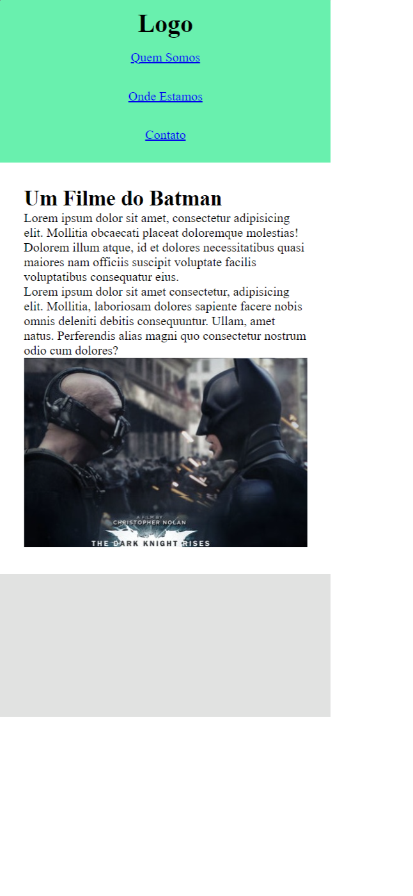

# Responsividade Media Queries
Projeto para exemplificar a responsividade com media queries utilizando HTML e CSS.

## Resultados Finais

- Versão Desktop:

- Versão Mobile:

## Tecnologias Utilizadas
- HTML
- CSS